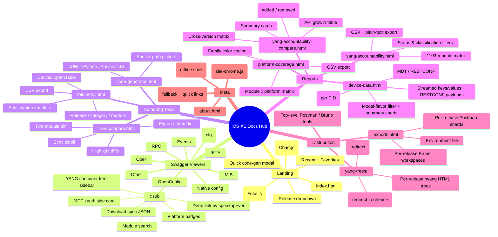

# APP_MAP — Cisco IOS XE OpenAPI / YANG Documentation Hub

> Generated: 2026-06-09 from source inspection of HTML/JS/JSON in the repo root.
> Confirmed = present in checked-in files. Inferred = derived from naming/usage but
> not directly read end-to-end. See "Unknowns" at the bottom.

---

## 1. Executive Summary

> **At-a-glance:** 
>
> Slide-ready PNG ([docs/exec_summary.png](docs/exec_summary.png)) — 1920×1080,
> generated by [scripts/build_exec_visual.py](scripts/build_exec_visual.py).

This workspace is a **static, GitHub-Pages-hosted documentation site** (no backend, no
framework) for the Cisco IOS XE programmability surface. It compiles every YANG model
into per-category OpenAPI 3.0 specs, renders them via Swagger UI, and adds purpose-built
JS tools on top: universal search, code generation, YANG tree diff, telemetry XPath
authoring, accountability/coverage reports, and per-platform support matrices.

Key facts:

- **Hosting**: GitHub Pages, scope `/cisco-ios-xe-openapi-swagger/`.
- **Releases tracked**: `26.1.1` (default), `17.18.1`, `17.15.x`, `17.12.x`, `17.9.x`
  ([releases/index.json](releases/index.json)).
- **Top-level pages**: 9 user-facing HTML + 1 404 + 2 redirector stubs + 9 Swagger UI
  viewers (one per model category).
- **No build system**: vanilla JS, strict CSP, Swagger UI from jsDelivr; data is
  generated offline by Python scripts under `generators/` and `scripts/`.
- **PWA**: service worker ([service-worker.js](service-worker.js)) precaches the shell;
  `releases/**`, `archive/**`, `tools/**` are explicitly bypassed.
- **Deep linking**: every interactive page persists state in URL hash/query
  (`#spec=`, `#op=`, `#ver=`, `#left=`, `#right=`, `q=`, `cat=`, `status=`).

---

## 2. Mind Map (Mermaid)

---

## 3. Page Inventory

Files use workspace-relative paths. "Scripts" lists JS dependencies; shared chrome
([assets/js/site-chrome.js](assets/js/site-chrome.js),
[assets/js/sw-register.js](assets/js/sw-register.js)) is loaded on most pages and is
not repeated below.

### 3.1 [index.html](index.html) — Documentation Hub (Landing)
- **Route**: `/` (`index.html`)
- **Purpose**: Entry point; surfaces every model category, a universal search box,
  stats dashboard, Recents/Favorites, and downloads.
- **UI**:
  - Header with dark-mode toggle, **release selector** (`#versionSelector`), badge.
  - Quick-nav toolbar linking to every top-level page and each Swagger viewer.
  - 9 color-coded **model cards** with per-category spec / path / op counts.
  - **Universal Search** (`#universalSearch`) with autocomplete, advanced filters
    (prefix, has-tree, has-spec), type filters, results panel.
  - External docs & downloads gradient blocks (Postman collections, env file).
  - **Statistics dashboard** — pie chart + table (Chart.js) per model.
  - Project summary info boxes and stat grid.
  - **Code Snippet Generator modal** (`#codeGenModal`) — quick curl/Python/Ansible/JS.
- **Data sources**: [search-index.json](search-index.json) (or
  `releases/<ver>/search-index.json`), [version-stats.json](version-stats.json),
  per-category `_paths_index.json`.
- **Scripts**: Fuse.js (CDN), Chart.js (CDN), [search.js](search.js),
  [recent-favorites.js](recent-favorites.js), [index-app.js](index-app.js),
  [hub-search-ops.js](hub-search-ops.js).
- **Permissions**: None — static.
- **Notes / TODO**: Static "Last Updated: April 25, 2026" string in markup
  (`#L325`-ish); stat counts in cards are static numbers but other figures are
  hydrated from `version-stats.json`.

### 3.2 [about.html](about.html) — About / Project Mission
- **Route**: `/about.html`
- **Purpose**: Narrative explanation of the project, capabilities, releases,
  architecture, contribution and feedback channels.
- **UI**: Static sections (`#mission`, `#stats`, `#capabilities`, `#releases`,
  `#architecture`, `#engage`, `#credits`), CTA buttons linking to GitHub Issues /
  CONTRIBUTING / CHANGELOG.
- **Data sources**: Static counts (608 specs, 37,072 paths, etc.) — **inferred to
  be hand-maintained** and may drift from [version-stats.json](version-stats.json).
- **Scripts**: site-chrome only.

### 3.3 [code-generator.html](code-generator.html) — API Code Generator
- **Route**: `/code-generator.html`
- **Purpose**: Generate `curl`, `Python (requests)`, `Ansible`, `JavaScript (fetch)`
  snippets for any RESTCONF call.
- **UI**: Form (host, method, path, username, password, body) + spec picker
  (`#specPicker`) + path picker (`#pathPicker`) populated from the active release's
  search index. "Generate Code", "Clear", "Copy Share Link" buttons. Tabbed output
  pane with per-language copy buttons.
- **Data sources**: [search-index.json](search-index.json) and per-spec OpenAPI JSON
  under `releases/<ver>/swagger-*-model/api/<name>.json`.
- **Scripts**: [deeplink.js](deeplink.js), [code-generator.js](code-generator.js).
- **Deep-link hash**: `#ver=&category=&spec=&path=&method=`.

### 3.4 [tree-compare.html](tree-compare.html) — YANG Tree Comparison
- **Route**: `/tree-compare.html`
- **Purpose**: Side-by-side diff of two YANG trees (any module × any module).
- **UI**: Two `<select>`s (`#module1`, `#module2`), per-side filter boxes
  (`#searchLeft`, `#searchRight`), Compare button, stats bar (total/matched/
  added/removed/modified), legend, split-pane viewer, Sync Scroll, Highlight Diffs,
  Export, "Copy as Text", "Copy Share Link". Dark mode toggle (floating).
- **Data sources**: `releases/<ver>/search-index.json`; per-tree HTML/text under
  `releases/<ver>/yang-trees/`.
- **Scripts**: [version-label.js](version-label.js), [tree-compare.js](tree-compare.js).
- **Deep-link hash**: `#left=&right=&ver=`.
- **Persistence**: `localStorage` key `iosxe-tree-compare-prefs` for toggle state.

### 3.5 [yang-accountability.html](yang-accountability.html) — Module Accountability Report
- **Route**: `/yang-accountability.html`
- **Purpose**: Per-release map of every YANG module → spec / tree / excluded-reason
  (claims 100% coverage). Search, filter, sort, paginate, export.
- **UI**: Summary stat grid, Category Summary table, search box, classification +
  status filter rows, **module matrix table** (pagination, sortable headers), "Export
  CSV", "Copy as Text", "Copy Share Link", exclusion-categories explainer.
- **Data sources**: [yang_accountability.json](yang_accountability.json) (root,
  legacy) or `releases/<ver>/yang_accountability.json`.
- **Scripts**: [version-label.js](version-label.js), [deeplink.js](deeplink.js),
  [yang-accountability.js](yang-accountability.js).
- **Deep-link hash**: `#ver=&q=&cat=&status=`.

### 3.6 [yang-accountability-compare.html](yang-accountability-compare.html) — Cross-Version Matrix
- **Route**: `/yang-accountability-compare.html`
- **Purpose**: Cross-release module presence matrix + API growth table + version-to-
  version deltas.
- **UI**: Summary cards per release, growth table (Specs / Paths / Ops / Δ),
  presence filter (`all`, `any`, `all-versions`, `diff`), search filter, CSV export,
  module matrix with pip markers (spec / tree / absent), deltas section.
- **Data sources**: [accountability_compare.json](accountability_compare.json),
  [version-stats.json](version-stats.json).
- **Scripts**: inline (no external module beyond site-chrome).

### 3.7 [telemetry.html](telemetry.html) — MDT XPath Builder
- **Route**: `/telemetry.html`
- **Purpose**: Compute gRPC dial-out `filter xpath` for any (release, category,
  module, OpenAPI path) per the formula in
  [MDT_XPATH_SPEC.md](MDT_XPATH_SPEC.md): `/<prefix>:<path-without-leading-slash>`.
- **UI**: Release/category/module pickers, path filter, info card, results table
  (Method / OpenAPI path / Derived xpath / copy), CSV export, subscription
  configuration template with Copy.
- **Data sources**: [yang-prefix-map.json](yang-prefix-map.json) (or per-release),
  per-spec OpenAPI JSON.
- **Scripts**: [version-label.js](version-label.js), [telemetry.js](telemetry.js).

### 3.8 [exports.html](exports.html) — Postman / Bruno Exports
- **Route**: `/exports.html`
- **Purpose**: Browse and download per-(release, model-category) export shards;
  pre-built to stay under ~50 MB import limits.
- **UI**: Release filter, format toggle (All / Postman only / Bruno only), per-
  release blocks with collection tables, environment-file link, helpful empty
  state pointing at `scripts/build_release.py`.
- **Data sources**: [releases/index.json](releases/index.json),
  `releases/<ver>/exports/postman-manifest.json`,
  `releases/<ver>/exports/bruno-manifest.json`.
- **Scripts**: inline (release iteration + table builder).

### 3.9 [platform-coverage.html](platform-coverage.html) — YANG × Platform Matrix
- **Route**: `/platform-coverage.html`
- **Purpose**: Show which IOS XE platforms (Catalyst families, IoT, wireless, etc.)
  expose each YANG module — derived from NETCONF capability files per release.
- **UI**: Release dropdown, free-text filter, platform dropdown, "Export CSV",
  scrollable matrix table with color-coded platform headers (`switching`, `routing`,
  `iot`, `wireless`, `other`).
- **Data sources**: [platform-support-index.json](platform-support-index.json),
  `releases/<ver>/platform-support.json`.
- **Scripts**: [assets/js/platform-coverage.js](assets/js/platform-coverage.js).
- **CSP note**: Page declares its own CSP (no external hosts).

### 3.10 [device-data.html](device-data.html) — Device Data Browser (MDT + RESTCONF)
- **Route**: `/device-data.html`
- **Purpose**: Browse *real* data collected from physical Catalyst switches and a
  9800 WLC over two transports, chosen with a selector at the top:
  **Model-Driven Telemetry** (push · gRPC dial-out) and **RESTCONF** (pull ·
  HTTPS GET). One UI for both — per device (PID), per model flavor (oper,
  OpenConfig, native, config, IETF, MIB, wireless), with the actual keys,
  values, and payloads captured.
- **UI**: transport selector (MDT / RESTCONF), device (PID) tabs, model-flavor
  filter chips, a searchable path list, transport-aware summary tiles + charts
  (Chart.js), and a per-path detail. MDT shows the streamed list **keys** and
  every captured instance's leaf values; RESTCONF lazily fetches and
  pretty-prints the GET response payload. Copy payload / Copy path on each detail.
- **Data sources**: [telemetry-live-data.json](telemetry-live-data.json) (MDT,
  built by `scripts/mdt-telemetry/collector/build_live_dataset.py`) and
  [restconf-live-data.json](restconf-live-data.json) (RESTCONF index, built by
  `scripts/build_restconf_dataset.py` from
  `releases/<ver>/live-examples-index.json`); RESTCONF payloads are fetched on
  demand from `releases/<ver>/live-data/<category>/<module>/<hash>.json`.
- **Scripts**: [device-data.js](device-data.js).
- **CSP note**: strict hub CSP (`script-src 'self'`); external JS, DOM-only,
  no `innerHTML`.

### 3.11 [yang-trees/index.html](yang-trees/index.html) — Redirector
- **Route**: `/yang-trees/`
- **Purpose**: Reads [releases/index.json](releases/index.json) and `window.location.replace`s
  to `../releases/<default>/yang-trees/`. Pure compatibility shim — legacy
  `href="yang-trees/"` links keep working.
- **UI**: Single message and a manual fallback link.

### 3.12 [yang-trees/mib-trees-index.html](yang-trees/mib-trees-index.html)
- Same pattern as 3.10, redirects to `releases/<default>/yang-trees/mib-trees-index.html`.

### 3.13 [404.html](404.html) — Not Found
- **Route**: served for unknown paths by GitHub Pages.
- **UI**: Static "404", main hub link, color-coded quick-links to all 9 viewers.
- **Scripts**: sw-register only.

### 3.14 [swagger-{oper,cfg,native-config,openconfig,ietf,mib,rpc,events,other}-model/index.html]
- **Route**: `/swagger-<category>-model/index.html` — one per category.
- **Purpose**: Swagger UI 5.31.0 viewer over the active release's
  `releases/<ver>/swagger-<category>-model/api/*.json` specs.
- **UI**:
  - Dark category header with version pill (`.header-version`).
  - Nav bar linking to all 9 viewer categories + Hub + Trees.
  - **Sidebar**: search box, stats (Specs / Paths / Ops), recursive YANG container
    tree built by [yang-tree-sidebar.js](yang-tree-sidebar.js).
  - **Main**: welcome card, download bar ("Download JSON", tree link, MDT panel
    toggle, "Copy Share Link"), platform badges (`platform-support.js`), MDT panel,
    Swagger UI container.
- **Scripts**: Swagger UI bundle + standalone-preset (CDN),
  [deeplink.js](deeplink.js), [yang-tree-sidebar.js](yang-tree-sidebar.js),
  [assets/js/platform-support.js](assets/js/platform-support.js),
  `paths-search.js` (per-viewer, present alongside each `index.html`).
- **Version awareness**: Hard-coded `__IOSXE_DEFAULT_VER__` and
  `__IOSXE_ALLOWED_VERS__`, baked by `scripts/patch_viewers_version_aware.py`.
- **Deep-link hash**: `#ver=&spec=&op=`.

### 3.14 [swagger-native-config-model/capabilities.html](swagger-native-config-model/capabilities.html)
- Sub-page of the native viewer. Per-category capability table (paths, ops,
  schemas, leafs, lists, choices) sourced from
  `releases/<ver>/native-capabilities.json`. Release picker + filter + counts.

### 3.15 Per-release tree pages
- `releases/<ver>/yang-trees/index.html` — release-scoped tree browser with a
  filter box and a card per YANG module that links to `<module>.html`.
- `releases/<ver>/yang-trees/<module>.html` — pre-rendered pyang tree per module
  (HTML). Hundreds per release.
- `releases/<ver>/yang-trees/mib-trees-index.html` — MIB tree index variant.

---

## 4. Feature Inventory

Grouped by capability, not by page.

### 4.1 Multi-release version switching
- **What**: Single "active release" concept (`26.1.1` default) drives every data
  fetch — `?ver=`, `#ver=`, `localStorage['iosxe-active-version']`, or the parent
  hub's `window.__IOSXE_ACTIVE_VERSION__`.
- **Where**: `#versionSelector` on hub; injected per-viewer dropdown by
  [assets/js/viewer-enhancements.js](assets/js/viewer-enhancements.js); silent
  inheritance everywhere else.
- **Implements**: [version-label.js](version-label.js), `__activeVer()` in each
  Swagger viewer, [yang-accountability.js](yang-accountability.js) `_activeVersion()`,
  [code-generator.js](code-generator.js), [telemetry.js](telemetry.js),
  [tree-compare.js](tree-compare.js), [search.js](search.js)
  `loadSearchIndexForActiveVersion()`.
- **Data**: [releases/index.json](releases/index.json) (default + allow-list).

### 4.2 Universal search (hub)
- **What**: Fuse.js fuzzy search across all modules with autocomplete, type
  filters, advanced filters, sort, related modules.
- **Where**: Hub `#universalSearch` + autocomplete + results pane.
- **Implements**: [search.js](search.js) (debounced, configurable
  `SEARCH_CONFIG`), [hub-search-ops.js](hub-search-ops.js) (lazy per-category
  operation-level hits via `_paths_index.json`).
- **Data**: [search-index.json](search-index.json), per-category
  `releases/<ver>/swagger-<cat>-model/api/_paths_index.json`.

### 4.3 Swagger UI rendering & deep-linking
- **What**: Each model category is a separately-rendered Swagger UI 5.31.0 viewer.
  Deep links of the form `#spec=<module>&op=<operationId>&ver=<release>` open and
  expand a specific operation.
- **Where**: All 9 `swagger-*-model/index.html` files.
- **Implements**: [deeplink.js](deeplink.js) (parseHash, setSpec, setSpecOp,
  tryExpandOp, MutationObserver auto-expand, click delegate to capture op IDs).
- **Helpers**: [yang-tree-sidebar.js](yang-tree-sidebar.js) builds the recursive
  container tree from each module's `pathList` / `pathOps`.

### 4.4 Code-generation (curl / Python / Ansible / JS)
- **What**: Two delivery surfaces — the **Quick Snippet modal** on the hub
  ([index-app.js](index-app.js) wires the form), and the **full
  [code-generator.html](code-generator.html) page** which can pre-select a real
  spec + path and reuse RFC 7951 example bodies.
- **Implements**: [code-generator.js](code-generator.js); per-language template
  generators with shareable URLs.

### 4.5 MDT XPath authoring
- **What**: Derive gRPC dial-out `filter xpath` for any operation, copy/share, and
  emit a subscription config template.
- **Where**: [telemetry.html](telemetry.html); a compact "MDT XPaths for this
  module" side card embedded in each Swagger viewer.
- **Spec**: [MDT_XPATH_SPEC.md](MDT_XPATH_SPEC.md).
- **Implements**: [telemetry.js](telemetry.js).
- **Data**: [yang-prefix-map.json](yang-prefix-map.json), per-spec OpenAPI files,
  `releases/<ver>/telemetry-index.json`.

### 4.6 YANG tree side-by-side compare
- **What**: Pick two modules, render their pyang trees, diff (added / removed /
  modified), sync-scroll, highlight, export, share.
- **Where**: [tree-compare.html](tree-compare.html).
- **Implements**: [tree-compare.js](tree-compare.js).

### 4.7 Accountability reports
- **Single-version**: [yang-accountability.html](yang-accountability.html) (1100+
  module matrix, filters, CSV, pagination).
- **Cross-version**: [yang-accountability-compare.html](yang-accountability-compare.html)
  (presence matrix, API growth, deltas).
- **Data producers** (inferred from comments): `scripts/build_accountability_compare.py`,
  `scripts/build_version_stats.py`.

### 4.8 Platform coverage matrix
- **What**: YANG-module × platform-id table per release, derived from NETCONF
  capability files. Family color coding, CSV export.
- **Where**: [platform-coverage.html](platform-coverage.html).
- **Implements**: [assets/js/platform-coverage.js](assets/js/platform-coverage.js).
- **Per-spec badges**: [assets/js/platform-support.js](assets/js/platform-support.js)
  reuses the same JSON to render chips inside each viewer.
- **Data**: [platform-support-index.json](platform-support-index.json),
  `releases/<ver>/platform-support.json`.

### 4.9 Postman / Bruno exports
- **What**: Pre-built per-(release, category) shards (≤50 MB each) + environment
  files. Top-level repo also ships the big legacy collections under
  [tools/](tools/) (linked from the hub).
- **Where**: [exports.html](exports.html); hub Downloads section.
- **Producer**: `scripts/build_release.py` (referenced in the empty state).
- **Manifests**: `releases/<ver>/exports/{postman,bruno}-manifest.json`.

### 4.10 Recent & Favorites
- **What**: LocalStorage-backed recently-viewed list and "starred" modules per
  user. Star entries persist `op` + `ver` so re-opens land on the same operation
  in the same release.
- **Implements**: [recent-favorites.js](recent-favorites.js) (storage keys
  `iosxe-recent-modules`, `iosxe-favorite-modules`).
- **Where**: Hub Recents/Favorites cards.

### 4.11 Dark mode / theming
- **Where**: Every page. Two legacy mechanisms unified into one toggle.
- **Implements**: [assets/js/site-chrome.js](assets/js/site-chrome.js) (`data-theme`
  attribute + `body.dark` class + `prefers-color-scheme` fallback).

### 4.12 PWA / Offline shell
- **What**: Service worker precaches the static shell, stale-while-revalidates
  HTML/JS/CSS, **bypasses** `releases/`, `archive/`, `tools/`, and all cross-origin.
- **Implements**: [service-worker.js](service-worker.js) (`CACHE_VERSION` = `v30-…`
  acts as cache kill-switch).
- **Registrar**: [assets/js/sw-register.js](assets/js/sw-register.js) (loaded on
  every page).

### 4.13 SEO + structured data
- Every top-level page has injected `og:`, `twitter:`, JSON-LD `WebSite` /
  `BreadcrumbList`, canonical URL. Injection comment markers
  `<!-- BEGIN seo-meta (managed by scripts/inject_seo_meta.py) -->`.

### 4.14 Share links / "Copy Share Link" buttons
- All interactive pages serialize their current state into URL hash/query and copy
  it to clipboard via `Copy Share Link` controls.

---

## 5. User Flows

### 5.1 First-time landing
1. User opens `/`. Service worker installs.
2. [index-app.js](index-app.js) restores theme, populates release dropdown from
   [releases/index.json](releases/index.json), fetches
   `releases/<active>/search-index.json` (fallback: root).
3. Pie chart + stats hydrate from [version-stats.json](version-stats.json).
4. Recent/Favorites populate from `localStorage`.

### 5.2 Universal search → spec
1. User types into `#universalSearch` (or presses `/` / `Ctrl+K`).
2. [search.js](search.js) debounces, runs Fuse query, renders cards.
3. [hub-search-ops.js](hub-search-ops.js) lazily fetches per-category
   `_paths_index.json` to surface operation-level matches.
4. Clicking a result opens `swagger-<cat>-model/index.html#spec=<module>&op=<id>&ver=<ver>`.
5. Viewer's [deeplink.js](deeplink.js) auto-expands the matching operation row.

### 5.3 Build & share a code snippet
1. User opens [code-generator.html](code-generator.html).
2. Picks a spec + path (or types a path manually), sets host/method/body.
3. Generated snippets render in 4 language tabs with Copy buttons.
4. "Copy Share Link" copies a URL containing `#ver=&category=&spec=&path=&method=`.

### 5.4 Diff two YANG trees
1. User opens [tree-compare.html](tree-compare.html) (often via "Compare" on a
   tree page that pre-fills one side).
2. Picks left + right modules.
3. Stats bar + legend + side-by-side panels update; user toggles Sync Scroll /
   Highlight Diffs (preferences persisted to `localStorage`).
4. Exports, copies as text, or shares via `#left=&right=&ver=`.

### 5.5 Author an MDT subscription
1. User opens [telemetry.html](telemetry.html). Picks release/category/module.
2. Table populates with each OpenAPI path and its **derived** filter xpath.
3. Clicking a row populates the subscription template; Copy or CSV-export.

### 5.6 Accountability deep dive
1. User opens [yang-accountability.html](yang-accountability.html) — sees the
   stat grid, category summary, paginated module matrix.
2. Searches/filters by classification/status, exports CSV, copies as text, or
   shares the exact filtered view via hash.
3. For cross-release context, jumps to
   [yang-accountability-compare.html](yang-accountability-compare.html).

### 5.7 Platform coverage check
1. User opens [platform-coverage.html](platform-coverage.html).
2. Picks a release, optionally filters by module substring or specific platform.
3. Sees the matrix; exports CSV.

### 5.8 Bulk download
1. User opens [exports.html](exports.html).
2. Filters by release + format, downloads shards + environment file.

### 5.9 Error / empty / loading states
- **Loading**: Sidebar shows `Loading...`, hub stats show `—`, tree panes show
  empty-state cards with help text.
- **Empty**: Exports page hides itself and shows "Run `python
  scripts/build_release.py --version <v>`"; capabilities page shows similar
  guidance.
- **Network**: Service worker stale-while-revalidate; viewer toast helper
  (`window.__showViewerToast`) for spec-load failures
  ([assets/js/viewer-enhancements.js](assets/js/viewer-enhancements.js)).
- **CSP block**: Hub fallback message replaces chart canvas with text status if
  Chart.js fails to load ([index-app.js](index-app.js) `_renderChartFallback`).
- **404**: [404.html](404.html) with quick links to every viewer.

---

## 6. Data / API Dependencies

All "APIs" are static JSON fetched over HTTP — no backend.

| File | Producer (inferred) | Consumed by |
|------|----------------------|-------------|
| [releases/index.json](releases/index.json) | scripts/build_release.py | every page that switches release |
| `releases/<ver>/search-index.json` (+ root [search-index.json](search-index.json) fallback) | scripts/generate_search_index.py | search.js, code-generator.js, tree-compare.js |
| `releases/<ver>/swagger-<cat>-model/api/<name>.json` | generators/*.py | Swagger UI, code-generator, telemetry |
| `releases/<ver>/swagger-<cat>-model/api/_paths_index.json` | scripts/build_paths_index.py (per hub-search-ops.js comment) | hub-search-ops.js |
| `releases/<ver>/yang_accountability.json` (+ root [yang_accountability.json](yang_accountability.json)) | scripts/build_accountability*.py | yang-accountability.js |
| [accountability_compare.json](accountability_compare.json) | scripts/build_accountability_compare.py | yang-accountability-compare.html |
| [version-stats.json](version-stats.json) | scripts/build_version_stats.py | hub stats, about, version compare |
| [platform-support-index.json](platform-support-index.json) + `releases/<ver>/platform-support.json` | scripts/build_platform_support.py (inferred) | platform-coverage.js, platform-support.js |
| [yang-prefix-map.json](yang-prefix-map.json) + per-release variant | generators (inferred) | telemetry.js |
| `releases/<ver>/exports/{postman,bruno}-manifest.json` | scripts/build_release.py | exports.html |
| `releases/<ver>/live-examples-index.json` | scripts/build_live_examples_index.py | scripts/build_restconf_dataset.py, viewer-enhancements.js |
| [telemetry-live-data.json](telemetry-live-data.json) | scripts/mdt-telemetry/collector/build_live_dataset.py | device-data.js (MDT transport) |
| [restconf-live-data.json](restconf-live-data.json) | scripts/build_restconf_dataset.py | device-data.js (RESTCONF transport) |
| `releases/<ver>/native-capabilities.json` | scripts/build_native_capabilities.py | swagger-native-config-model/capabilities.html |
| `releases/<ver>/telemetry-index.json`, `telemetry-skipped.json` | inferred from filenames; presumed telemetry pipeline | telemetry.js / build inputs |
| `releases/<ver>/mib-metadata.json`, `mib-platform-matrix.json` | inferred | MIB viewer side cards |
| `releases/<ver>/path_depth_audit.json`, `tree_audit.json` | inferred QA artifacts | not directly bound to UI |
| `releases/<ver>/exports/postman/*.json`, `exports/bruno/**` | scripts/build_release.py | hub download card → exports.html (per-release, split <50 MB) |

External: Microsoft Clarity telemetry to `*.clarity.ms` (always-on in this
deployment). Every core third-party UI library is still vendored under
`assets/vendor/` with SHA-384 SRI verification (Swagger UI 5.31.0,
fuse.js 7.0.0, chart.js 4.4.0). No CDN or web-font dependencies for the
site shell itself. See [docs/SELF_HOSTING.md](docs/SELF_HOSTING.md).

LocalStorage keys observed:
- `theme`
- `iosxe-active-version`
- `iosxe-recent-modules`
- `iosxe-favorite-modules`
- `iosxe-tree-compare-prefs`

URL/hash params recognized:
- `?ver=`, `#ver=` (every page)
- `#spec=`, `#op=` (Swagger viewers, recent-favorites round-trip)
- `#left=`, `#right=` (tree-compare)
- `#q=`, `#cat=`, `#status=` (yang-accountability)
- `#ver=&category=&spec=&path=&method=` (code-generator)

---

## 7. Unknowns & Recommended Follow-up

Items flagged **Needs verification** or that fell outside this static read:

1. **Stale static numbers** — **RESOLVED (2026-06-16).** [about.html](about.html)
   now hydrates its "By the numbers" cards from
   [version-stats.json](version-stats.json) via [about-stats.js](about-stats.js)
   (`data-stat-about` hooks), and [index.html](index.html) hub cards, category
   table, search placeholder, project-summary boxes and "Last Updated" date are
   all synced to the 26.1.1 default (988 specs / 82,856 paths / 246,677 ops /
   1,469 tracked modules) via `data-stat-*` hydration. Static markup remains only
   as no-JS fallbacks.
2. **native-augment-accountability.html** — **REMOVED (2026-06-18).** Deleted as
   a stale static page (pinned to 17.18.1, no live inbound links). The canonical,
   version-aware reports are [yang-accountability.html](yang-accountability.html)
   and [yang-accountability-compare.html](yang-accountability-compare.html).
3. **per-spec `paths-search.js`** — referenced from every Swagger viewer but not
   read here; assume per-category enhancer mirroring `hub-search-ops.js`.
4. **archive/** vs live pages — [archive/debug.html](archive/debug.html),
   [archive/test-stats.html](archive/test-stats.html),
   [archive/test-swagger.html](archive/test-swagger.html) exist; sitemap and nav
   exclude them, service-worker bypasses `archive/`. Confirm none are still
   reachable.
5. **`index-v2.html` redirect stubs** — **REMOVED (2026-06-18).** The 8 remaining
   `swagger-*-model/index-v2.html` redirect stubs were deleted (the events one
   went with swagger-events-model). They were never in the sitemap, nav, or
   service-worker precache; per the backwards-breaking-changes policy, old
   `-v2` bookmarks now resolve via the 404 page to the hub.
6. **Auth model** — Not applicable (static site), but the
   [code-generator.html](code-generator.html) form ships a default password
   (`cisco123`) and the hub modal embeds the same. Confirm acceptable for a
   public DevNet sandbox; do not let real credentials get autofilled by browsers.
7. **Telemetry-index data flow** — `releases/<ver>/telemetry-index.json` and
   `telemetry-skipped.json` exist on disk but the consumption path inside
   [telemetry.js](telemetry.js) was not traced end-to-end here.
8. **Search index drift** — **RESOLVED (2026-06-16).** [search.js](search.js)
   prefers `releases/<ver>/search-index.json` but falls back to the root file;
   `scripts/generate_search_index.py` rebuilds the root `search-index.json` from
   `releases/<default_version>/` on every run, so the fallback always matches the
   default release (no mismatch for users who land mid-deploy).
9. **`hub-search-ops.js`** baked `TARGET_VER = '26.1.1'` as a fallback —
   **RESOLVED (2026-06-16).** `scripts/patch_viewers_version_aware.py` now
   re-stamps the constant from `releases/index.json`'s `default`, so it advances
   automatically with the default release.
10. **MIB-specific UI** — references to `mib-metadata.json` and
    `mib-platform-matrix.json` suggest extra side cards in the MIB viewer not
    fully captured here.
11. **Documentation drift** — `PROJECT_REQUIREMENTS.md`, `QUICK_REFERENCE.md`,
    `ASSURANCE_SPEC.md`, `MDT_XPATH_SPEC.md`, `VERSIONING.md`,
    `GITHUB_PAGES_DEPLOY.md`, `YANG_MODULE_ACCOUNTABILITY.md`,
    `FAQ.md`, `CONTRIBUTING.md`, `AGENTS.md`, `CHANGELOG.md` all coexist at the
    root. Confirm which are authoritative.

---

## 8. Cleanup / Consolidation Suggestions

Where the audit found duplication, drift, or unfinished surface area.

1. **Single source of truth for headline counts.** **DONE (2026-06-16).** Every
   "specs / paths / ops / modules" number in [about.html](about.html) and the hub
   project-summary / category-table sections is now bound to `version-stats.json`
   via `data-stat-*` hooks (about-stats.js / index-app.js). The
   "April 25, 2026" / "608 specs" drift is resolved.
2. **Retire `index-v2.html` stubs** — **DONE (2026-06-18).** All 8 remaining
   redirect stubs deleted.
3. **Remove `native-augment-accountability.html`** — **DONE (2026-06-18).**
   Deleted (stale, pinned to 17.18.1, no live inbound links). The canonical,
   version-aware reports are [yang-accountability.html](yang-accountability.html)
   and [yang-accountability-compare.html](yang-accountability-compare.html).
4. **Centralize the version-detect helper.** Five files re-implement
   `_activeVersion()` (`search.js`, `yang-accountability.js`, `code-generator.js`,
   `telemetry.js`, `tree-compare.js`, each Swagger viewer). One shared helper in
   `assets/js/` would prevent subtle behavioural drift. *(2026-06-16: hardened
   against the concrete drift risks rather than forcing a sweeping cross-page
   refactor — (a) the `localStorage` key-capitalisation bug in `code-generator.js`
   (`iosxeActiveVersion` vs canonical `iosxe-active-version`) is fixed;
   (b) `hub-search-ops.js`'s baked `TARGET_VER` fallback is now re-stamped from
   `releases/index.json` by `scripts/patch_viewers_version_aware.py` so it can no
   longer go stale when the default advances; (c) that patch script's
   `build_helper` was itself stale — it would have re-introduced a removed
   default-version `api/` short-circuit (404s) and a space-form `Cisco IOS XE`
   title regex that no longer matches the hyphenated `Cisco IOS-XE` viewer titles
   — now corrected so the generator is idempotent against the live viewers;
   (d) `yang-accountability.js`'s `_activeVersion()` was missing the
   `localStorage` fallback tier, so a direct visit to `yang-accountability.html`
   after picking a non-default release on the hub silently fell back to the root
   default — normalised to the canonical `?ver=` → `#ver=` → hub global →
   `localStorage` precedence used by `code-generator.js` / `tree-compare.js`.)*
5. **Promote per-viewer inline CSS into shared stylesheets.** `tree-compare.html`,
   `platform-coverage.html`, `exports.html`, and `yang-accountability-compare.html`
   each carry hundreds of lines of inline CSS that duplicate
   `assets/css/site.css`.
6. **Document the data/build pipeline.** A simple Mermaid diagram showing
   `generators/*.py → releases/<ver>/**` and `scripts/build_*.py → root JSON
   indexes` would let new contributors trace any number on the site back to the
   script that produced it.
7. **Audit the archive folder.** It mixes one-off debug HTML, completed-phase
   TODO docs, and stale JSON. A pass to delete vs. preserve would shrink the
   service-worker bypass list and search-index noise.
8. **Standardize "Copy Share Link" behaviour.** Buttons appear on the hub,
   viewers, accountability, code-generator, tree-compare. Each implementation
   serializes a slightly different param set; a shared helper would help.

---

*End of APP_MAP.md*
